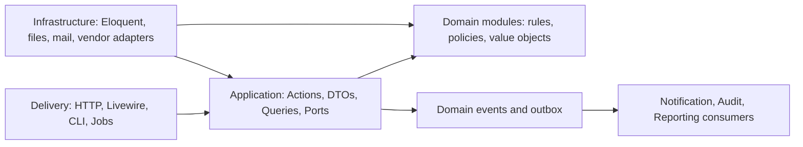
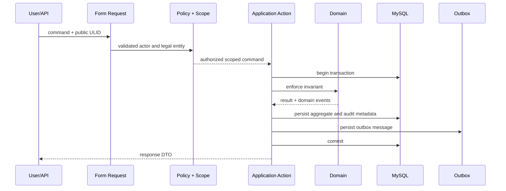

# Phase 2.1 — Architecture Overview

Tanggal baseline: 2 Agustus 2026

## Tujuan

Menetapkan struktur modular monolith yang menjaga aturan HR, payroll,
multi-company, approval, dan audit tetap dapat diuji tanpa memecah aplikasi
menjadi microservice sebelum kebutuhan operasional membuktikannya.

## Scope dan non-goal

Dokumen ini menetapkan dependency direction, ownership data, integration
pattern, transaction boundary, dan prinsip deployment. Phase 2 tidak membuat
fitur bisnis, migration domain lengkap, formula payroll/statutory, UI final,
atau memilih dependency yang belum melewati compatibility gate.

## Bentuk sistem

Satu aplikasi Laravel dan satu database MySQL melayani seluruh legal entity.
Isolasi dilakukan pada application, authorization, dan query layer; bukan
dengan database terpisah per perusahaan.



Dependency wajib menuju ke dalam:

1. Delivery memvalidasi input dan memanggil Application Action.
2. Application mengatur authorization, transaction, idempotency, dan
   orchestration use case.
3. Domain memegang invariant dan kalkulasi tanpa mengetahui HTTP/Livewire.
4. Infrastructure mengimplementasikan port yang dimiliki Application/Domain.
5. Eloquent model adalah persistence model, bukan pemilik seluruh business
   logic.

## Struktur target

```text
app/
├── Application/<Module>/{Actions,DTOs,Queries,Contracts}
├── Domain/<Module>/{Entities,Enums,Policies,Rules,ValueObjects,Events}
├── Infrastructure/{Persistence,Files,Attendance,Mail,Queue}
├── Http/{Controllers,Middleware,Requests}
├── Livewire/
├── Models/
└── Policies/
```

Folder dibuat saat vertical slice modul dimulai. Phase 2 tidak membuat folder
kosong atau class placeholder.

## Request dan command flow



Read queries tetap melewati legal-entity scope dan field-level permission.
Reporting boleh memakai read model/query khusus, tetapi tidak boleh menulis ke
tabel sumber modul lain.

## Consistency dan transaction

- Satu use case kritis memakai satu database transaction.
- Cross-module write dilakukan melalui Application Action pemilik data, bukan
  mengubah model modul lain secara langsung.
- Event yang harus diproses setelah commit disimpan melalui transactional
  outbox; queue handler wajib idempotent.
- External integration tidak dipanggil di tengah transaction panjang.
- Payroll calculation membaca snapshot, bukan master data yang dapat berubah.
- Approval action, leave ledger, attendance event, audit, dan payroll locked
  bersifat append-only/immutable sesuai lifecycle-nya.

## Deployment boundary

Web, queue worker, dan scheduler menjalankan codebase yang sama. Pemisahan
process tidak mengubah ownership module. MySQL adalah source of truth; cache,
queue, object storage, email, dan fingerprint adapter tidak boleh menjadi
source of truth transaksi HR/payroll.

## Observability contract

Setiap proses kritis membawa `request_id`/`correlation_id`, actor, legal entity,
dan public subject identifier. Log aplikasi tidak boleh memuat NIK lengkap,
rekening, salary, token, password, 2FA secret, dokumen, atau payload payroll.

## Architecture decisions

- [ADR-0001 — Modular monolith](../adr/0001-modular-monolith.md)
- [ADR-0002 — Legal-entity isolation](../adr/0002-legal-entity-isolation.md)
- [ADR-0003 — Temporal data and UTC](../adr/0003-temporal-data-and-utc.md)
- [ADR-0004 — Identifiers and database conventions](../adr/0004-identifiers-and-database-conventions.md)
- [ADR-0005 — Decimal money and rounding](../adr/0005-decimal-money-and-rounding.md)
- [ADR-0006 — Generic approval snapshots](../adr/0006-generic-approval-snapshots.md)
- [ADR-0007 — Audit and sensitive data](../adr/0007-audit-and-sensitive-data.md)

## Enforcement plan

- Phase 4 menambahkan identity, permission, Policy, scoped query, dan negative
  authorization tests.
- Setiap vertical slice menambahkan architecture test untuk memastikan Domain
  tidak bergantung pada Delivery/Infrastructure.
- Pull request yang menambah cross-module dependency wajib memperbarui boundary
  map atau ditolak.
- Semua migration ditinjau terhadap database design dan data dictionary Phase 2.
