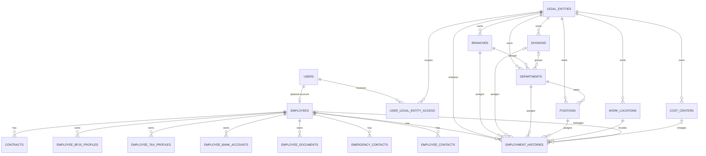
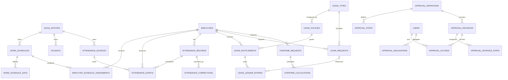
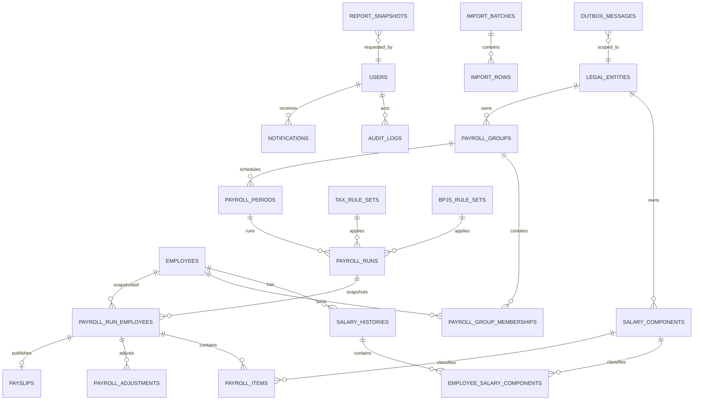

# Phase 2.2 — Logical ERD

Diagram ini menunjukkan ownership dan relasi logis. Detail kolom, constraint,
index, retention, dan classification berada di
[data dictionary](data-dictionary.md). Generic approval/audit subjects memakai
type registry + public ID sehingga garis polymorphic tidak dianggap foreign key.

## Organization, identity, dan Core HR

`employees.current_legal_entity_id` adalah pointer scope/current state untuk
query operasional. Source of truth perpindahan tetap `employment_histories`;
transfer menutup interval lama dan membuat interval baru dalam transaction.

## Time, leave, overtime, dan approval

Leave/attendance/overtime request terhubung ke approval secara polymorphic
melalui registered subject type + public ID. Business request menyimpan
`approval_instance_id` untuk lookup terkontrol setelah instance dibuat.

## Compensation, payroll, statutory, dan operations

Payroll run employee dan item adalah snapshot. Foreign key ke employee/component
dipertahankan untuk traceability, tetapi nama, organization, bank masked data,
rule version, quantity, rate, dan amount yang dipakai tersimpan pada snapshot
sehingga historical output tidak berubah.

## Cross-cutting polymorphic references

| Table | Reference | Integrity compensation |
|---|---|---|
| `approval_instances` | `subject_type` + `subject_public_id` | allowlisted registry, existence/entity validation, immutable summary snapshot, reconciliation test |
| `audit_logs` | `subject_type` + `subject_public_id` | event schema, no cascade delete, redacted snapshot |
| `outbox_messages` | aggregate type + public ID | event schema version, unique event public ID, consumer idempotency |
| `report_snapshots` | report type + parameter hash | authorized entity set snapshot, checksum, expiry/retention |
| `idempotency_keys` | scope + key hash | request fingerprint, result type/public ID, expiry |
