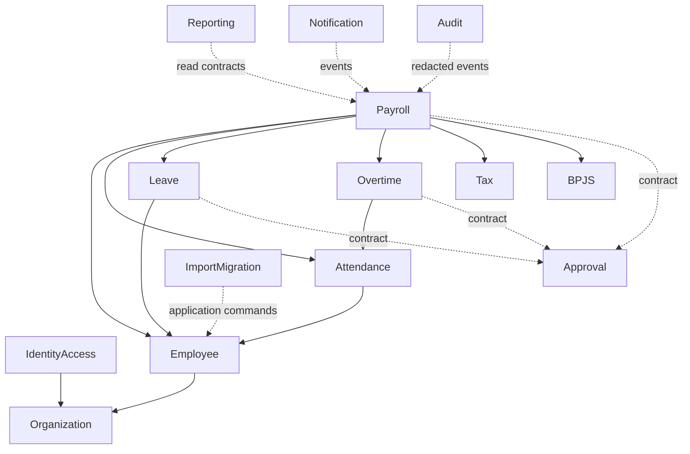

# Phase 2.1 — Module Boundaries

## Ownership map

| Module | Owns | May consume | Must not do |
|---|---|---|---|
| IdentityAccess | user identity, authentication, session, role/permission assignment, legal-entity access | Organization scope identifiers, Audit events | Grant payroll visibility implicitly to technical admin |
| Organization | legal entity, branch, division, department, position, location, cost center | Audit | Store employee personal/payroll data |
| Employee | employee profile, employment history, contract, contact, document metadata, bank/tax/BPJS profile history | Organization identifiers, Approval result, Audit | Calculate payroll or overwrite effective history |
| Attendance | source adapters, schedule, event, daily record, correction | Employee assignment, Organization, Approval result | Post unvalidated anomaly directly to payroll |
| Leave | type/policy, entitlement, ledger, request | Employee, Organization, Approval result | Derive balance from one mutable column |
| Overtime | request, actual validation, calculation eligibility | Employee, Attendance, Organization, Approval result | Decide payroll amount without approved rules |
| Payroll | salary configuration, period/run lifecycle, snapshots, items, adjustments, lock | Employee snapshots, Attendance, Leave, Overtime, Tax, BPJS, Approval | Mutate locked run or read current master for historical result |
| Tax | effective-dated PPh 21 rule set and calculator | Payroll input contract | Hard-code unverified tariff in controller/model |
| BPJS | effective-dated program/rule set and calculator | Payroll input contract | Change locked payroll output retroactively |
| Approval | definition/version, resolved instance steps, action history, delegation | Actor and organization resolver contracts | Import concrete Leave/Payroll model classes into Domain |
| Reporting | authorized read models, exports, snapshots | Read contracts from all modules | Write source-of-truth business tables |
| Notification | template metadata and delivery jobs | Post-commit domain events | Block payroll transaction while sending email |
| Audit | immutable security/business audit records | Redacted domain/security events | Store secrets or unredacted restricted payloads |
| ImportMigration | batch/row provenance, mapping, reconciliation | Application Actions of target modules | Bypass validation, authorization, or invariants with direct inserts |

## Dependency direction

Panah menunjukkan konsumsi contract/data, bukan izin untuk menulis tabel milik
module tujuan secara langsung.

## Inter-module rules

1. Referensi lintas module memakai scalar ID/value object/DTO; Domain tidak
   menerima Eloquent model module lain.
2. Pemilik data menyediakan command/query contract pada Application layer.
3. Synchronous call hanya untuk invariant yang harus selesai dalam transaction
   yang sama; side effect memakai post-commit event/outbox.
4. Approval memakai `subject_type` terdaftar dan `subject_public_id`. Kehilangan
   foreign key database dikompensasi dengan registry, application validation,
   immutable subject snapshot, dan integration test.
5. Audit menerima redacted event; Audit module tidak mengambil seluruh model
   untuk membuat diff sendiri.
6. Reporting boleh melakukan join lintas module melalui query khusus read-only
   yang selalu menerima authorized legal-entity scope.
7. ImportMigration memanggil Action yang sama dengan UI/API dan menyimpan
   source row serta hasilnya.

## Core contracts

| Contract | Provider | Consumers | Minimum payload |
|---|---|---|---|
| `LegalEntityScope` | IdentityAccess/Organization | all tenant modules | actor, allowed legal entity IDs, requested entity |
| `EmployeeAssignmentSnapshot` | Employee | Attendance, Leave, Overtime, Payroll | employee public ID, entity, org assignment, manager, effective interval |
| `AttendancePayrollInput` | Attendance | Payroll | period, normalized hours/days, validation status, source references |
| `LeavePayrollInput` | Leave | Payroll | approved unpaid/paid units and ledger references |
| `OvertimePayrollInput` | Overtime | Payroll | approved eligible units, rule/version references |
| `TaxCalculation` | Tax | Payroll | rule-set ID/version, bases, results, rounding evidence |
| `BpjsCalculation` | BPJS | Payroll | rule-set ID/version, programs, bases, employee/employer results |
| `ApprovalSubject` | business modules | Approval | type, public ID, entity, requester, risk class, immutable summary |
| `AuditableEvent` | all modules | Audit | event, actor, entity, subject, redacted before/after, correlation ID |
| `NotifiableEvent` | all modules | Notification | template key, recipients by authorized resolver, non-sensitive context |

## Forbidden coupling examples

- Payroll controller querying attendance tables and calculating deduction.
- Leave model decrementing an employee balance column.
- Approval Domain importing `PayrollRun` or `LeaveRequest` Eloquent classes.
- Report export accepting legal entity IDs directly from request without an
  authorized scope intersection.
- Import job writing `employees` with raw SQL to skip validation.
- Technical Super Admin receiving salary/payroll permission through role name.

## Change protocol

New module dependency requires: owner, use case, contract, direction, data
classification, transaction decision, failure behavior, tests, and update to
this document. Cyclic domain dependency blocks merge until orchestration is
moved to Application or an explicit shared value contract is introduced.
