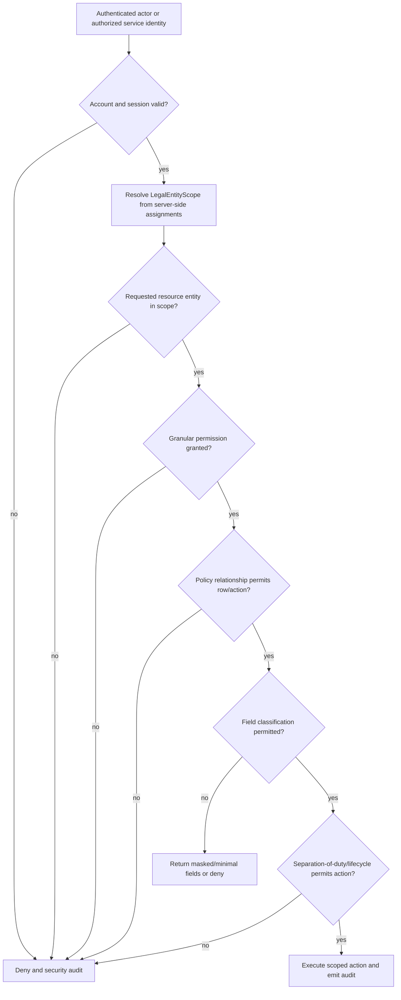

# Phase 2.3 — Multi-Company and Security Model

## Security objective

Setiap request, job, report, export, dan file download harus membuktikan siapa
actor-nya, capability apa yang dimiliki, legal entity mana yang diizinkan,
relationship row mana yang boleh dilihat, dan field classification apa yang
boleh dibuka. Ketiadaan salah satu bukti menghasilkan deny.

## Authorization decision flow

Route/client `legal_entity_id` tidak pernah menjadi authorization evidence.
Resource dicari menggunakan public ULID di dalam authorized entity set. Response
untuk resource di luar scope menggunakan not-found/denied behavior yang tidak
membocorkan keberadaan data.

## Scope types

| Scope | Resolution | Typical use |
|---|---|---|
| Self | authenticated user linked employee | ESS profile, own attendance/request/payslip |
| Direct team | effective reporting line at relevant business date | Supervisor approval/team view |
| Branch | assigned branch within authorized entity | Branch Manager dashboard/approval |
| Legal entity | active `user_legal_entity_access` + permission | Company HR/Payroll/Finance |
| Entity set | explicit set of active assignments | Group HR/Auditor group report |
| Global technical | technical configuration only | Super Admin; no implicit restricted business data |

Historical report uses reporting line/entity assignment “as of” report date,
not only current manager pointer. Acting/delegated authority never expands the
delegator's original entity and permission boundaries.

## Initial role-permission matrix

`S` scoped access, `R` restricted and explicit, `A` approval-only, `—` denied by
default. Exact permission records are implemented and tested in Phase 4.

| Capability | Super Admin | Group HR | Company HR | Payroll Admin | Finance Reviewer | Final Approver | Manager/Supervisor | Employee | Auditor |
|---|---:|---:|---:|---:|---:|---:|---:|---:|---:|
| Technical configuration | S | — | — | — | — | — | — | — | read if assigned |
| Role/permission administration | S | — | — | — | — | — | — | — | read if assigned |
| Employee basic view | — by default | S | S | minimal S | minimal S | minimal S | team S | self | read S |
| Employee master update | — | S | S | — | — | — | — | controlled request | — |
| Sensitive identity/document view | explicit R | explicit R | explicit R | — | bank subset R | — | — | self subset | explicit read R |
| Salary view/update | explicit R / — | explicit R / maker | scoped maker | R / — | review R / — | approval summary | — | — | explicit read R |
| Attendance/leave/overtime | — | S | S | payroll input only | — | — | team S/A | self S | read S |
| Payroll prepare/calculate | — | — | — | S | — | — | — | — | — |
| Payroll review | — | — | — | cannot final | S | — | — | — | read if assigned |
| Payroll approve/lock | — | — | — | — | — | A | — | — | read if assigned |
| Payroll reopen | — | — | — | request | A | A | — | — | read if assigned |
| Payslip | — | support only with R | support only with R | publish S | review totals | publish approval if policy | — | own | read only if explicit |
| Report/export | technical only | S/R by report | S/R by report | payroll S | finance S | summary S | team S | own | read S/R |
| Audit view | technical/security subset | HR subset | entity HR subset | payroll subset | payroll subset | approval subset | own actions | own actions | explicit S/R |

Role names never grant access by themselves; permission plus scope plus Policy
must all pass. Super Admin is deliberately not a payroll reader.

## Permission naming

Use stable capability keys, for example:

- `employees.view`, `employees.create`, `employees.update`,
  `employees.view-sensitive`;
- `documents.view`, `documents.download`, `bank-accounts.verify`;
- `salaries.view`, `salaries.propose`, `salaries.review`, `salaries.approve`;
- `attendance.view`, `attendance.correct`, `leave.approve`,
  `overtime.approve`;
- `payroll.prepare`, `payroll.calculate`, `payroll.review`,
  `payroll.approve`, `payroll.lock`, `payroll.reopen`;
- `payslips.publish`, `reports.export`, `audit.view`,
  `audit.view-security`.

Avoid permissions containing entity code or role name. Scope is data, not part
of capability string.

## Query and application enforcement

1. Application Action requires an explicit actor and `LegalEntityScope`.
2. Tenant query contract refuses empty/unspecified scope except audited system
   maintenance operations.
3. Eloquent local scopes/repositories add `WHERE legal_entity_id IN (...)`.
4. Policy checks action and row relationship; controller menu visibility is
   presentation only.
5. Create/update validates every tenant foreign key against the same entity.
6. Queue message carries entity/public IDs and an authorized service operation,
   never a serialized authenticated user/model.
7. CLI/admin command requires an explicit entity or `--all-entities` capability
   plus confirmation/audit.
8. Reporting/export snapshots the authorized entity set at request time and
   rechecks permission on download.

Direct unscoped `Model::find`, `Model::all`, route binding by numeric ID, and
client-controlled query scope are forbidden on tenant request paths.

## Data classification controls

| Class | Examples | Minimum controls |
|---|---|---|
| Restricted | salary/payroll, bank, NIK/NPWP/BPJS, identity/health/biometric documents, password/2FA, security audit | explicit field permission, tenant scope, encryption/blind index where applicable, masking, private storage, access/export audit, no logs/fixtures |
| Confidential | address, phone, family/contact, employment history, attendance/GPS/selfie, leave/overtime, contracts | scoped Policy, least fields, private storage where file, access audit for high-risk view/export |
| Internal | organization, schedule, calendar, announcement | authenticated scoped access and change audit |
| Public | approved company name/logo/public notice | publication approval and integrity control |

API/DTO/resource uses field allowlists. `toArray()` of a full employee/payroll
model is not an acceptable response or audit strategy.

## Encryption and lookup

- Canonicalize identifiers before encryption/hash according to approved format.
- Encrypt restricted value at application boundary using versioned key ID.
- Store only required masked suffix for display.
- Equality search/uniqueness uses keyed blind index; plain SHA hash without key
  is insufficient for low-entropy identifiers.
- Key material stays outside repository/database and is separated by
  environment.
- Rotation uses dual-read/new-write migration plan and produces audit evidence.
- Salary/payroll decimal fields remain queryable but are protected by
  authorization, database/storage encryption at rest, restricted backups, and
  access/export audit.

## Private file model

Upload validates extension, MIME using server inspection, size, filename,
malware workflow when available, and classification. Storage path is generated;
original filename is metadata only. Response adds safe download name and
`nosniff`/content disposition headers. Signed URL lifetime is short and created
only after Policy; highly restricted documents may stream exclusively through
an authorized controller.

## Approval and separation of duty

- Salary: HR maker → Finance reviewer → Authorized Director.
- Payroll: Payroll Administrator → Finance reviewer → Final approver → lock.
- Reopen payroll: reason plus at least Finance and Final Approver approval.
- Bank change: HR verification → Finance verification.
- Creator cannot satisfy checker/final step on the same sensitive subject.
- Delegation cannot allow self-approval or expand entity scope.
- Empty approver resolution routes to controlled HR exception queue; restricted
  transactions never auto-approve.

Definition and resolved steps are snapshotted. Organization changes after submit
do not rewrite approval history.

## Audit event catalog

Audit at minimum:

- login success/failure, lockout, reset, 2FA/session/device changes;
- role, permission, entity-scope, delegation, and impersonation changes;
- sensitive employee view, document download, report export;
- employee/employment/contract/bank/tax/BPJS/salary changes;
- attendance sync/anomaly/correction, leave ledger adjustment, overtime result;
- every approval transition and approver resolution/fallback;
- payroll create/calculate/validation/review/approve/lock/publish/reopen;
- statutory rule/config changes and activation;
- import upload/validation/import/reconciliation;
- retention, legal hold, key rotation, backup/restore administrative actions.

Audit uses allowlisted redacted fields. Sensitive read/export audit contains
subject, purpose/reason where required, result count, parameter hash, entity set,
and correlation ID—not exported content.

## Break-glass

No break-glass access is implemented implicitly. If approved later, it requires
strong authentication, explicit permission, reason/ticket, time limit, entity
and field scope, alert to data owner/security, immutable audit, and post-event
review. It must not bypass payroll lock or alter audit.

## Database least-privilege design

| Identity | Environment | Rights |
|---|---|---|
| `peoplehub_migrator` | staging/production deployment only | schema migration DDL/DML needed by reviewed release; no interactive app use |
| `peoplehub_runtime` | application | CRUD only on application tables/sequences needed; no DDL, grant, user management, file privilege, or unrestricted administrative rights |
| `peoplehub_worker` | queue/scheduler | same or narrower table rights than runtime based on implemented jobs; no DDL |
| `peoplehub_report_reader` | approved reporting job | read-only approved views/tables with entity/field controls enforced by application; no direct end-user credentials |
| `peoplehub_backup` | backup service | minimum consistent backup/read/lock metadata rights; no application login; secret rotated separately |
| `peoplehub_monitor` | monitoring | connection/health metrics only; no business table content |

Local Laragon `root` tanpa password tetap local-only. Staging/production
credential berbeda per environment, disimpan di secret manager/deployment
configuration, rotated, dan tidak pernah masuk repository.

## Mandatory negative tests by implementation phase

- User cannot request entity outside assignment by changing URL/body/filter.
- Employee cannot access another employee's resource or payslip ULID.
- Supervisor cannot access non-team or historical team outside valid date.
- Company HR cannot read another entity.
- Group HR can access only explicitly assigned entity set.
- Super Admin cannot view payroll without explicit restricted permission/scope.
- Finance cannot edit employee/attendance; Payroll maker cannot final approve.
- Export/download is denied after permission/scope revocation.
- Cross-entity foreign key is rejected on create/update/import.
- Queue/import cannot bypass Policy/invariant through serialized model/direct DB.

## Threat and control review

| Threat | Primary controls | Evidence required later |
|---|---|---|
| IDOR/public ID guessing | ULID + scoped query + Policy + not-found behavior | Phase 4/5 security tests |
| Cross-company leakage | explicit entity scope, tenant-first query/index, FK consistency | isolation test suite and report/export review |
| Privilege escalation | granular permission, no role-name trust, audited grants | role matrix tests |
| Maker self-approval | resolved step snapshot + separation constraints | salary/payroll workflow tests |
| Sensitive data in logs/audit | allowlist/redaction, no model serialization | log/audit fixture inspection |
| File URL leakage | private disk, Policy, short signed URL/controller stream | download authorization tests |
| Duplicate offline/import command | idempotency key/fingerprint + unique constraint | integration/concurrency tests |
| Historical payroll drift | effective versions + payroll snapshot + immutable lock | golden/immutability tests |
| Encryption key compromise | external keys, environment separation, rotation plan | operational key-rotation evidence |

## Review gates carried forward

- Named security/data owners and break-glass approver are still required.
- Legal/privacy review must approve retention, health/biometric access, legal
  hold, and deletion/anonymization policy.
- Actual MySQL grants are implemented and verified before staging, using the
  identities above; this document closes design, not environment provisioning.
